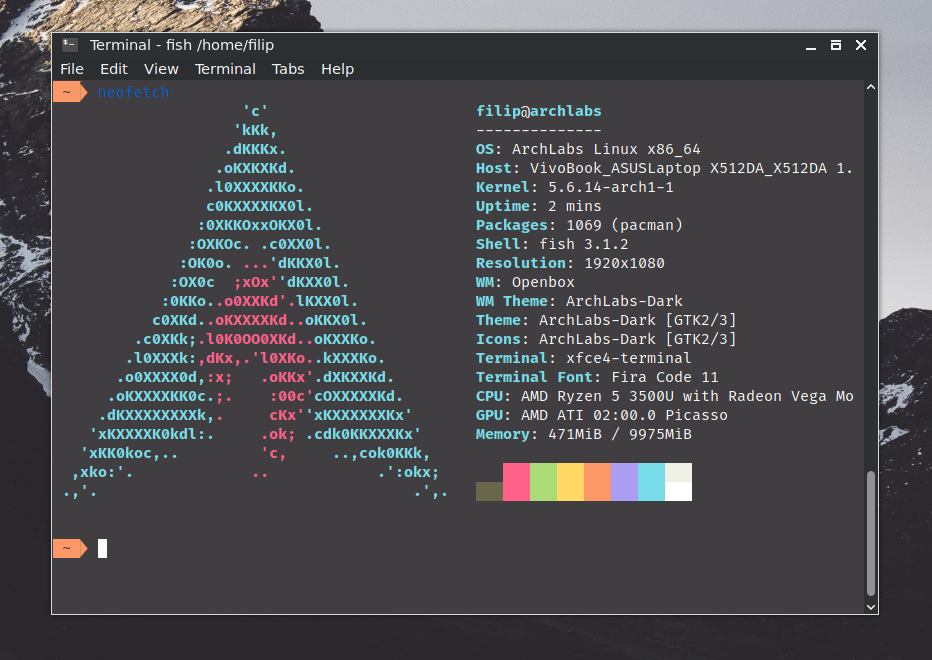

# Mono amber style theme

## Instalation

The theme is available for Xfce Terminal and LXTerminal. To install the theme for the Xfce Terminal run:

```bash
sudo cp mono-amber-xfce.theme /usr/share/xfce4/terminal/colorschemes/
```

To use the theme for the LXTerminal you can edit the config file `~/.config/lxterminal/lxterminal.conf` and replace the colors with the ones provided in `mono-amber-lxterminal.conf`.

## Screenshot


